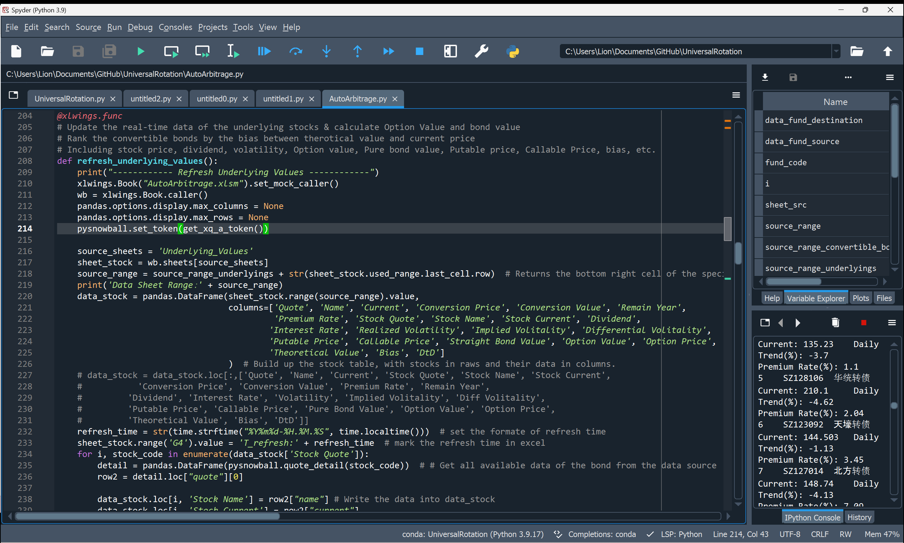

# Convertible Bonds Analysis Tool

## Description
This tool automates the analysis and ranking of convertible bonds based on various financial metrics and strategies. It integrates real-time financial data, updates convertible bond and underlying stock values, and evaluates them against single-factor or multifactor models for optimal decision-making. Based on the public data, the tool can calculate the implied volitality, option feature value, and price bias of the selected convertible bonds, as well as the implied distance to default (DtD) of the corresponding stock. Designed for financial analysts and investors, it leverages Python libraries such as `xlwings` for Excel integration, `pandas`, `numpy`, and `scipy.stats` for data manipulation, and `pysnowball` for accessing financial data from snowball's API.

## Installation

1. **Clone the Repository**
   ```
   git clone <https://github.com/Yannik-Linn/CB_AutoArbitrage_Stratigies>
   ```
   
2. **Install Dependencies**
   - Ensure Python 3.x is installed on your system. For example:
     https://www.python.org/ftp/python/3.9.9/python-3.9.9-amd64.exe
   - Install the required Python libraries:
     ```
     pip install pandas schedule xlwings requests scipy pysnowball browser-cookie3 chinese_calendar
     ```

## Usage

1. **Setup Excel**
   - Open the Excel workbook designed to work with this tool: AutoArbitrage.xlsm
   - Ensure macros are enabled for `xlwings` integration. Open the console to run:
     ```
     xlwings addin install
     ```
   - Enable Trust access to the VBA project object model under File > Options > Trust Center > Trust Center Settings > Macro Settings. Select "Turn on VBA macrons" and click "Trust the visit for VBA project subject models"
   - Set Firefox as your default explorer, to allow the program to visit the data source website and obtain a free token

2. **Run the Program**
   - Execute the main script to start the analysis:
     ```
     python main.py
     ```
     
   - Alternatively, you may also click the "Refresh" button in every sheet of the excel file, which will allow the xlwings to call UDF server to exeucate the scripts related to each sheet.
     

## Features
- **Real-time Data Updates**: Fetches and updates convertible bond and underlying stock data in real-time.
  
  
- **Arbitrage Opportunity Searching**: with several strategies for price value mismatches, such as low premium rate, high value-bias rotation, high differential volatility, and others.
  
  
- **Multifactor Ranking Models**: Includes several strategies for ranking convertible bonds, such as low premium rate, double low strategy, high differential volatility, and others.
  
  
- **Excel Integration**: Directly updates and manipulates Excel spreadsheets with financial data for easy analysis.
  
  

## Contributing
Contributions are welcome! Please open an issue or submit a pull request with your suggestions or enhancements.

## License
This project is licensed under the [MIT License](LICENSE.md) - see the LICENSE file for details.

## Acknowledgments
- Special thanks to the [pysnowball](https://github.com/uname-yang/pysnowball) project for providing an accessible API for financial data.

## FAQs
- **Q: How often is data updated?**
  - A: The tool is designed to refresh data based on the user's execution of the script. Scheduled updates can be set within the script using the `schedule` library.
- **Q: Why there is an error code 400016 when I run the script?**
  - A: The means you token for the data source does not exist or has expired. Please make sure you have set Firefox as the default explorer and closed Chrome and MS Edge completely.
- **Q: Why there is an message showing : no available data for year 2024, only year between [2004, 2023] supported. ?**
  - A: Your chese_calendar has expired, please update it by run:
     ```
     pip install -U chinese_calendar
     ```    
- **Q: Why the interest rate is same and unchanged?**
  - A: The risk free interest rate is assumed by the **China 10-Year Government Bond Yield**. Since the data source in use does not provide this data, you need to update it by hand from, e.g.: https://tradingeconomics.com/china/government-bond-yield.
